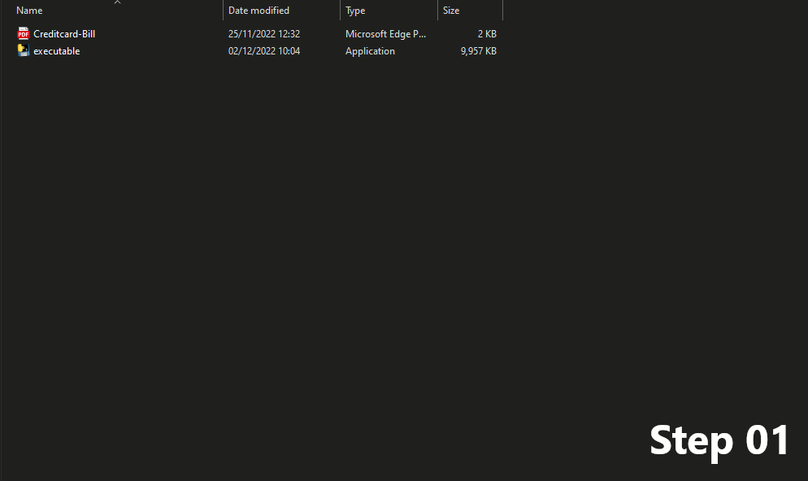
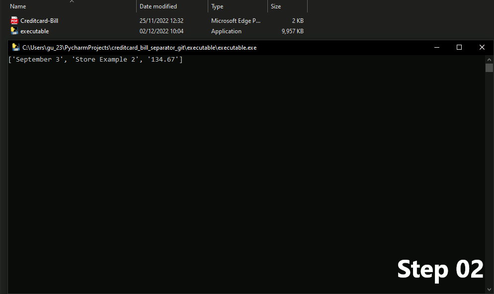
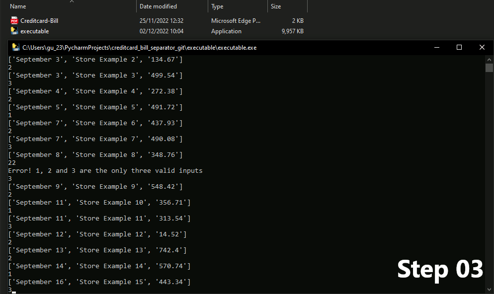
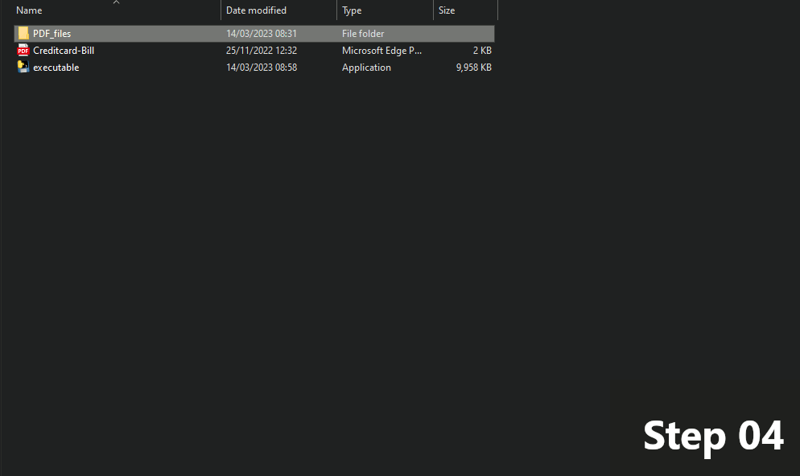

# Creditcard Bill Separator

>Description

I made this program to assist me in dividing the bill of my credit card with to more people of my family, because they use it to make purchase as well.

The program works by reading my credit card bill in PDF format, extracting the purchases and presenting than to the user so he/she can select which person is going to pay that purchase. After that the program will create one PDF for each person and inside will be every purchase selected for that person, with the total amount that he/she has to pay.

>GIF demonstrating each step:

## Disclaimers

The made some changes to the code for privacy and made a fake bill for the some reason.\
The program only woks with the PDF that is in the github repository.

## How it works

>Execute the executable in a folder with the “Creditcard-Bill.pdf”.
>
>

>A terminal box will open and show a list with 3 items, the first one will be the date of the purchase, the second is the name of the store and the third is the price.
>
>

>You select who will receive the bill by choosing between 1, 2 and 3, each number correspond to a person written in the code and you can choose 0 as well, which it will discard the bill, it is useful for  some purchase that were turn over but still were written in the bill.
>
>

>After all purchases were select to each person the terminal will close and a folder call “PDF_files” will be created and inside it will be 3 PDFs with the name of the person written in the source code, inside each PDF will be a chart it all purchase sected for that person and the total to be paid.
>
>

## 